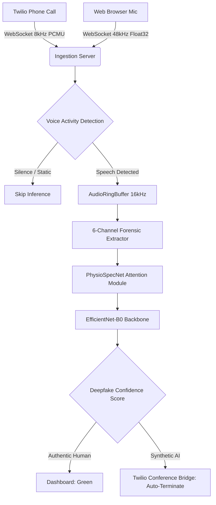

# SWIFT: Speech and Waveform Investigative Forensic Toolkit

[](https://www.python.org/downloads/)
[](https://pytorch.org/)
[](https://fastapi.tiangolo.com/)
[](https://opensource.org/licenses/MIT)

SWIFT is an enterprise-grade, real-time deepfake audio detection system and forensic analysis dashboard. It is engineered to differentiate between authentic human speech and high-fidelity synthetic AI voices generated by modern text-to-speech engines.

The platform utilizes a high-performance Python backend for feature extraction and neural inference, paired with a real-time web dashboard for live microphone streaming and Twilio telecommunication integration.

## End-to-End Architecture

The following diagram illustrates the complete data pipeline, from audio ingestion to the future implementation of Twilio in-call conference bridging for automated fraud prevention.



### 1. Ingestion and Preprocessing

SWIFT is optimized for live streaming environments and handles raw audio across multiple domains.

* **Dynamic AudioRingBuffer:** Audio chunks arrive via WebSockets in `Float32Array` or base64 PCMU formats. The buffer maintains a rolling 32,000 sample window. To prevent digital boundary artifacts that trigger false positives, the buffer is padded with calculated low-level Gaussian dither.
* **Hardware Native Resampling:** Mobile browsers often ignore standard sample rate requests, resulting in pitch manipulation. SWIFT captures audio at the native hardware rate and dynamically applies Fourier-resampling to 16kHz on the backend.
* **Voice Activity Detection (VAD):** Running inference on background noise introduces erratic confidence scores. SWIFT utilizes an algorithmic VAD gate based on Peak and Root Mean Square energy calculations to bypass the neural network during silence.

### 2. Feature Extraction

Standard audio models compress high frequencies to replicate human hearing. This compression destroys the microscopic synthetic artifacts left by AI generators. SWIFT resolves this by analyzing audio across six distinct acoustic dimensions using a custom forensic tensor.

1. **LFCC (Linear Frequency Cepstral Coefficients):** Preserves high-frequency spectral reflections commonly left by AI vocoders.
2. **Formant Trajectory Map:** Maps the physical resonant frequencies of the human vocal tract.
3. **Glottal Noise Excitation (GNE) Spectrum:** Analyzes the closure of the vocal folds, a physiological process AI struggles to emulate flawlessly.
4. **Jitter and Shimmer Micro-variation Map:** Measures frame-to-frame variations in pitch and amplitude. Humans exhibit natural micro-tremors, whereas AI models are often mathematically perfect.
5. **Instantaneous Phase Unwrapping Map:** Captures phase incoherence. Generative AI vocoders destroy phase alignment, creating a strict synthetic signature.
6. **Spectral Flux and Harmonic-to-Noise Ratio (HNR):** Detects synthetic smoothness and abrupt energy transitions.

### 3. Neural Architecture: PhysioSpecNet

PhysioSpecNet is a custom neural network built specifically for processing the 6-channel forensic tensor.

* **Cross-Channel Attention Module:** The 5 physiological channels dynamically attend to and modulate the primary LFCC channel. This highlights critical inconsistencies between raw acoustic features and physical spectral data.
* **EfficientNet-B0 Backbone:** The modulated tensor is processed by an EfficientNet-B0 backbone. This architecture was selected for its exceptional ability to extract complex 2D visual patterns while maintaining the low computational overhead required for real-time inference.

### 4. Overcoming the Hardware Domain Gap

Modern smartphones apply un-bypassable hardware-level neural noise suppression. These proprietary chips aggressively isolate human voices by applying heavy algorithmic gating, which destroys phase coherence and high-frequency harmonics. This process leaves behind the exact same acoustic artifacts as generative AI deepfakes.

To resolve this domain gap, the model was aggressively fine-tuned on mobile-suppressed microphone dumps. The cross-channel attention mechanism was trained to distinguish between hardware-induced noise suppression and true AI vocoder artifacts. The model currently achieves 100% accuracy and a 0% Equal Error Rate across both studio and mobile domains.

## Twilio Integration and Future Scope

SWIFT natively supports bi-directional WebSocket streaming with Twilio Media Streams. Twilio transmits 8kHz PCMU audio, which SWIFT decodes and upsamples to 16kHz using optimal Fourier decimation to prevent aliasing.

**Future Implementation:** 
Once the model is deployed to production, the pipeline will integrate directly with the Twilio Conference Bridge API. When SWIFT detects a synthetic AI voice on an active phone line, the system will programmatically trigger a webhook to intercept the call, alert the human operator, or automatically terminate the fraudulent connection before a social engineering attack can execute.

## Repository Structure

```text
SWIFT/
├── src/                    # Core Python package
│   ├── features/           # LFCC and 6-Channel Spectrogram extraction logic
│   ├── models/             # PhysioSpecNet architecture and Attention mechanisms
│   ├── realtime_stream.py  # AudioRingBuffer and VAD engine
│   └── config.py           # Hyperparameters
├── public/                 # Web dashboard frontend
├── checkpoints/            # Pre-trained PyTorch weights
├── scripts/                # Evaluation and benchmarking scripts
├── tests/                  # Unit tests for the pipeline
├── data/                   # Datasets (git-ignored)
├── docs/                   # Convergence graphs and metrics
├── server.py               # Main API and WebSocket server
├── evaluate_and_train.py   # Primary fine-tuning and evaluation script
└── requirements.txt        # Python dependencies
```

## Installation and Quickstart

### Prerequisites
* Python 3.9+
* NVIDIA GPU (CUDA) recommended for real-time inference

### Setup

Clone the repository and install the required dependencies:

```bash
git clone https://github.com/codebreaker77/SWIFT.git
cd SWIFT
pip install -r requirements.txt
```

### Running the Live Server

Start the backend WebSocket server and frontend dashboard:

```bash
python server.py 8000
```
Navigate to `http://localhost:8000` in a web browser. Grant microphone permissions to test the real-time deepfake detector.

### Fine-Tuning the Model

To fine-tune the model on custom hardware profiles or specific datasets:

```bash
python evaluate_and_train.py
```
This script will parse audio samples, apply required augmentations, compute the 6-channel acoustic feature maps, train PhysioSpecNet, and overwrite the checkpoint weights based on Validation Loss optimization.
