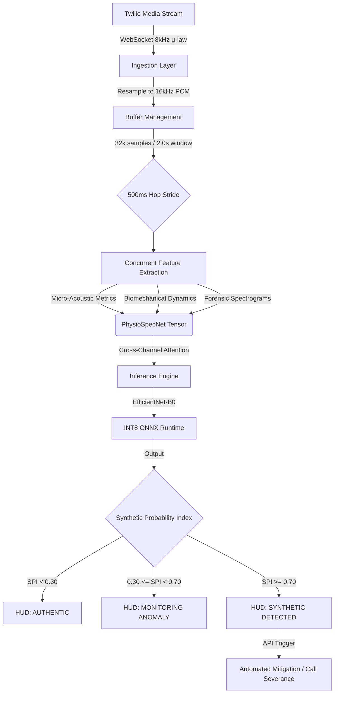

# SWIFT: Speech and Waveform Investigative Forensic Toolkit

[](https://www.python.org/downloads/)
[](https://pytorch.org/)
[](https://onnxruntime.ai/)
[](https://fastapi.tiangolo.com/)
[](https://opensource.org/licenses/MIT)

SWIFT is an enterprise-grade, real-time deepfake audio detection system engineered specifically for telephony and live-call environments. It is designed to evaluate bidirectional telecommunication streams and differentiate between authentic human speech and high-fidelity synthetic AI voices generated by modern text-to-speech engines or voice cloning vocoders.

The platform utilizes a high-performance Python backend for concurrent acoustic feature extraction and quantized neural inference, integrating directly into telephony providers via WebSockets.

## End-to-End Architecture

The following diagram illustrates the complete data pipeline, from telephonic audio ingestion through quantized inference and automated policy enforcement.



### 1. Ingestion Layer (Telephony and Streaming)

* **Audio Ingestion:** Ingests live dual-channel or mono phone audio via Twilio Media Streams or a WebRTC audio stream over a secure WebSocket (`wss://`) at 8 kHz μ-law.
* **Resampling and Normalization:** Standardizes and upsamples the incoming byte stream into linear 16-bit 16 kHz PCM arrays using optimal Fourier decimation to prevent high-frequency aliasing.

### 2. Buffer Management (FastAPI Sliding Window)

* **Sliding Window Buffer:** Maintains an in-memory ring buffer holding a rolling 2.0-second window (32,000 samples).
* **Hop Stride:** Executes inference on a 500 ms rolling interval to enable sub-second temporal overlap and low-latency continuous monitoring.
* **Algorithmic VAD:** Integrates Voice Activity Detection via Peak and Root Mean Square energy gating to bypass inference during pure silence, preserving compute resources.

### 3. Concurrent Feature Extraction (Parallel Pipeline)

Standard audio models compress high frequencies to replicate human hearing, destroying the microscopic synthetic artifacts left by AI generators. SWIFT resolves this by projecting the 2.0-second buffer across six distinct acoustic dimensions:

* **Micro-Acoustic Metrics:** Evaluates Spectral Flatness, Phase Entropy, and Spectral Centroid Variance to detect vocoder anomalies. Includes an **Instantaneous Phase Unwrapping Map** to capture phase incoherence, a strict signature of generative AI vocoders.
* **Biomechanical Vocal Dynamics:** Measures Pitch Jitter, Shimmer, and the Glottal-to-Noise Excitation (GNE) spectrum to assess natural vocal cord micro-irregularities. Humans exhibit natural micro-tremors, whereas synthetic cloning outputs are mathematically perfect.
* **Deep Forensic Representations:** Utilizes Linear Frequency Cepstral Coefficients (LFCC) alongside high-resolution Formant Trajectory Maps to expose high-frequency synthesis anomalies and ensure physical consistency in resonant frequencies.

### 4. Inference Engine (PhysioSpecNet via INT8 ONNX Runtime)

* **Feature Fusion (Cross-Channel Attention):** Aggregates the acoustic metrics and spectral representations into a dense `(6, 224, 224)` tensor. The physiological channels dynamically attend to and modulate the primary LFCC channel, highlighting inconsistencies between acoustic features and physical spectral data.
* **Quantized Inference:** Processes the modulated tensor through the EfficientNet-B0 backbone of our custom **PhysioSpecNet** model. The network is exported and executed via an INT8-quantized deep learning pipeline on ONNX Runtime for strict latency adherence.
* **Output Metric:** Generates a continuous **Synthetic Probability Index (SPI)** calibrated from `0.00` (Organic Human) to `1.00` (Synthetic or Cloned).

### 5. Automated Policy Engine and Decision Logic

The evaluated SPI dictates programmatic action within the telephony environment.

* **Nominal State (SPI < 0.30):** Verified authentic stream; session integrity remains authenticated.
* **Elevated Risk State (0.30 ≤ SPI < 0.70):** Triggers continuous telemetry polling and escalates session logging for post-call audit.
* **High-Confidence Threat (SPI ≥ 0.70):** Authenticates a spoofing event and executes automated mitigation protocols. This triggers automated call severance or programmatic mute via the Twilio REST API.

### 6. Live In-Call Telemetry and Heads-Up Display (HUD) Widget

* **Low-Latency Telemetry Channel:** Broadcasts per-window forensic payloads over bidirectional WebSockets (`wss://telemetry/session-id`) with under 50 ms transmission latency.
* **Floating In-Call Status Widget:** Displays a non-intrusive heads-up monitoring widget on the agent interface featuring:
  * **Dynamic Integrity Gauge:** Live circular or linear risk meter tracking real-time SPI score fluctuations.
  * **Spectral Confidence Breakdown:** Visual micro-bars displaying metric weights (Acoustic Jitter, Phase Coherence, LFCC Anomaly).
  * **Real-Time Forensic Banner:** Dynamic status badge (`AUTHENTIC` | `MONITORING ANOMALY` | `SYNTHETIC DETECTED`).
  * **Incident Action Controls:** Inline programmatic action triggers permitting one-click session isolation, secondary challenge-response prompt injection, or instant call severance.

## Repository Structure

```text
SWIFT/
├── src/                    # Core Python package
│   ├── features/           # LFCC and 6-Channel Spectrogram extraction logic
│   ├── models/             # PhysioSpecNet architecture and Attention mechanisms
│   ├── realtime_stream.py  # AudioRingBuffer and VAD engine
│   └── config.py           # Hyperparameters
├── public/                 # Web dashboard frontend (HUD logic)
├── checkpoints/            # Pre-trained PyTorch weights
├── scripts/                # Evaluation and benchmarking scripts
├── tests/                  # Unit tests for the pipeline
├── data/                   # Datasets (git-ignored)
├── docs/                   # Convergence graphs and metrics
├── server.py               # Main API and WebSocket server
├── evaluate_and_train.py   # Primary fine-tuning and evaluation script
└── requirements.txt        # Python dependencies
```

## Installation and Quickstart

### Prerequisites
* Python 3.9+
* ONNX Runtime compatible host environment

### Setup

Clone the repository and install the required dependencies:

```bash
git clone https://github.com/codebreaker77/SWIFT.git
cd SWIFT
pip install -r requirements.txt
```

### Running the Live Server

Start the backend WebSocket server and telemetry dashboard:

```bash
python server.py 8000
```
Navigate to `http://localhost:8000` to access the HUD. Expose the port via a tunneling service to configure the Twilio Media Streams webhook.

### Fine-Tuning the Model

To adapt the model to specific telephony hardware profiles:

```bash
python evaluate_and_train.py
```
This script parses audio samples, computes the 6-channel acoustic feature maps, trains PhysioSpecNet, and overwrites the checkpoint weights based on Validation Loss optimization.
